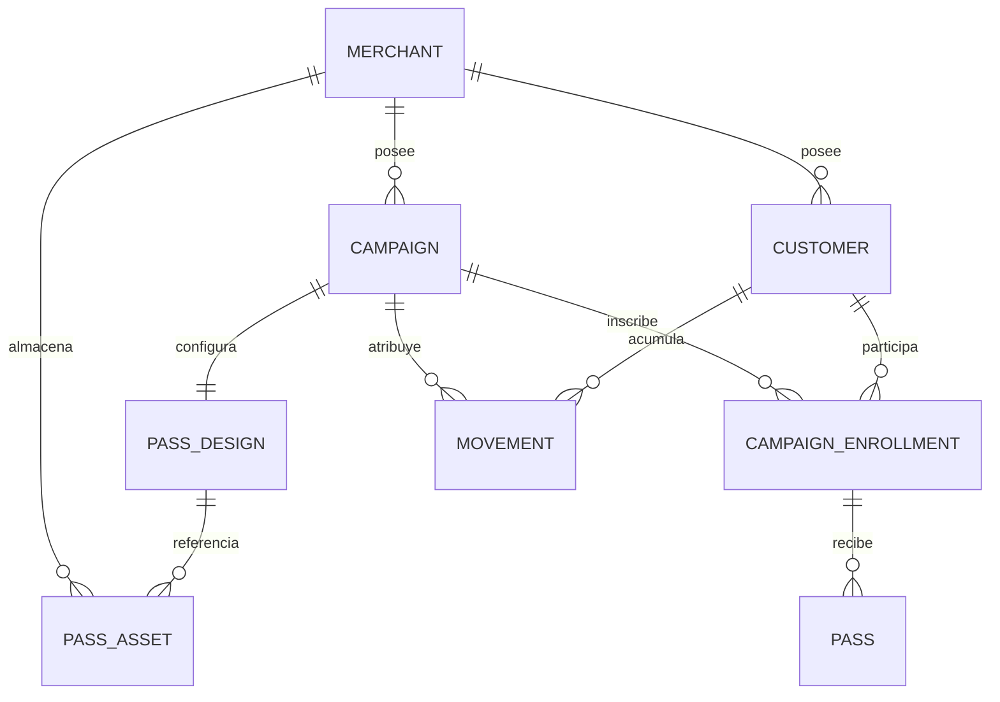

# Campañas, inscripciones y diseño de pases

Implementación actualizada el 22-09-2026. Esta guía sustituye las reglas anteriores de inscripción implícita. La configuración predeterminada permite probar la API de negocio sin autenticación (`AUTH_ENABLED=false`); el panel de administración siempre exige usuario, contraseña y sesión.

## Arquitectura y decisiones

Se mantienen FastAPI/Pydantic, SQLAlchemy/SQLite, sesiones Bearer, React/Vite, diccionario ES/EN, pytest/Playwright y Compose. No se introduce Alembic ni una biblioteca de componentes. La migración se integra en `init_db`, como las migraciones anteriores.

El repositorio ya había adoptado explícitamente BLOB en SQLite para logos. `services/pass_assets.py` conserva esa decisión y aísla validación, almacenamiento, referencias, URLs y limpieza para permitir otra implementación futura. Diseño y metadatos se guardan separados del contenido; no se duplica el objeto JSON por cliente. Pillow es la única dependencia nueva y permite verificar los bytes reales y normalizar imágenes.



- Un cliente pertenece a un único comercio. No se introduce una identidad global.
- La inscripción tiene UUID, campaña, cliente, estado `active/suspended/cancelled`, `enrolled_at`, `created_at`, `updated_at` y token QR aleatorio. `UNIQUE(campaign_id, customer_id)` impide duplicados incluso después de una baja; la reactivación es explícita.
- Las claves foráneas y los índices se crean en SQLite. Dos triggers también impiden inscribir por SQL a un cliente de otro comercio. La API valida pertenencia y autorización antes de cada operación.
- `pass_design.campaign_id` es simultáneamente PK y FK: solo hay un diseño por campaña. Una campaña `ready` exige logo, hero y diseño válido. `draft` es inactiva y puede estar incompleta, con cero clientes.
- Un comercio recién creado tiene `onboarding_status=pending_campaign` hasta disponer de su primera campaña completada. Así se conserva el alta del comercio antes de diseñar su primera campaña. No se inventa una campaña predeterminada.
- El alta del cliente admite `campaign_ids`. Sin selección queda `membership_status=pending`, conservando importaciones/altas parciales. No obtiene puntos ni pases hasta inscribirse.
- La fuente de verdad de los puntos es `SUM(movement.points_delta)` para cliente y campaña. `Customer.points_balance` sigue siendo el agregado compatible; `legacy_points_balance` conserva diferencias antiguas sin atribución. Nunca se copia un saldo global a varias campañas.
- Archivar desactiva la campaña y anula sus pases; conserva inscripciones e historial. Suspender/cancelar la inscripción anula sus pases y detiene su acumulación. Eliminar cliente/campaña/comercio conserva el comportamiento de baja lógica y reintentos durables de Google/Apple.

## Interfaz

Campañas → Nueva campaña o Editar contiene cuatro secciones accesibles: datos/reglas, diseño, clientes y revisión. Permite subir y sustituir logo y hero, editar sus descripciones, escoger color con selector y campo `#RRGGBB`, idioma, etiqueta del cliente, etiqueta de puntos, etiqueta de antigüedad y texto bajo el QR. El título muestra el nombre del comercio; los datos del cliente, puntos e identificadores se obtienen automáticamente. La selección de clientes incluye búsqueda y estado de inscripciones previas. El alta puede terminar sin clientes.

La previsualización se actualiza con el formulario y se repite en la revisión. Identifica como ejemplos el nombre, 320 puntos, fecha y QR; no persiste esos valores ni promete reproducir exactamente la aplicación de Google. Tiene estados de carga y errores, etiquetas, foco visible y disposición móvil.

Clientes permite indicar nombre, fecha de alta en el comercio y varias campañas durante el alta; muestra pendientes y saldo por campaña. La API recibe `joined_on` (fecha ISO, no futura) y conserva la fecha en `Customer.created_at`, con medianoche UTC si se introduce manualmente. Si se omite, usa el instante actual. El pase muestra exactamente tres letras del mes y el año (`sep 2026` o `Sep 2026` según idioma), sin punto. La inscripción conserva su propia fecha `enrolled_at`, que no sustituye la antigüedad del cliente. Pases Wallet solo ofrece clientes con inscripción activa en la campaña seleccionada. La asignación muestra la URL y el QR de instalación como antes.

## API y autorización

Prefijo `/api/v1`. Esquemas y cuerpos aparecen en `/docs`, `/redoc` y `/openapi.json`. Con `AUTH_ENABLED=false`, las operaciones de negocio admiten acceso anónimo, incluidas escrituras, imágenes, pagos y callbacks/descargas Apple. Solo las llamadas sin token usan un contexto de administrador transitorio. El panel siempre inicia sesión con credenciales reales: `/auth/login` valida usuario/contraseña, `/users/me` y `/auth/logout` siempre exigen Bearer. Se crean y revocan sesiones reales; el idioma se conserva por usuario. Una sesión aportada se valida y conserva el rol/comercio del administrador, aunque la API permita llamadas anónimas. Una sesión caducada o revocada nunca se convierte en acceso anónimo.

Swagger mantiene la autenticación de las rutas de perfil/logout y deja sin requisito las operaciones de negocio. El login del panel no restringe las llamadas directas a la API abierta: cualquier persona que alcance su URL puede consultar y modificar los comercios sin token en este modo de prueba.

Con `AUTH_ENABLED=true` también se exige sesión Bearer o token Apple para las operaciones de negocio. Un `sme_admin` autenticado solo puede operar en su comercio; un `super_admin` puede seleccionar cualquiera. Se comprueba el comercio autenticado incluso cuando la URL/cuerpo contiene `merchant_id`. Las imágenes publicadas siguen siendo públicas. En ambos modos se impide vincular un cliente o imagen a campañas de otro comercio: las relaciones de datos se validan independientemente del control de acceso.

| Método y ruta | Comportamiento |
| --- | --- |
| GET/POST `/merchants/{merchant_id}/campaigns` | Listar o crear campaña, diseño y clientes opcionales en una transacción. |
| GET/PUT `/campaigns/{campaign_id}` | Detalle y edición completa. El tipo no se cambia después del alta. |
| PUT `/campaigns/{campaign_id}/design` | Sustituir diseño/activos. Los diseños completados siempre conservan ambas imágenes. |
| POST `/campaigns/{campaign_id}/archive` | Desactivar, conservar historial y notificar anulación de pases. |
| GET/POST `/campaigns/{campaign_id}/customers` | Listar inscripciones o alta por lotes con `customer_ids`; repetir una inscripción activa es idempotente. |
| PATCH `/campaigns/{campaign_id}/customers/{customer_id}` | Cambiar `status`: active, suspended o cancelled. |
| GET `/customers/{customer_id}/campaigns` | Inscripciones, estados y saldos por campaña. |
| GET `/campaigns/{campaign_id}/customers/{customer_id}/passes` | Pases de esa pareja, sin emitirlos. |
| POST `/customers/{customer_id}/passes` | Asignación existente: `{campaign_id, platform}`; exige inscripción activa. |
| POST `/customers/{customer_id}/passes/{pass_id}/link` | Obtener enlace y datos para generar QR de instalación. |
| POST `/merchants/{merchant_id}/pass-assets` | Cuerpo binario de imagen; devuelve ID, URL y metadatos, HTTP 201. No es multipart. |
| GET `/merchants/{merchant_id}/pass-assets/{asset_id}` | Metadatos con autorización. |
| GET `/merchants/{merchant_id}/pass-assets/{asset_id}/content` | Previsualizar imagen privada con autorización, `no-store`. |
| DELETE `/merchants/{merchant_id}/pass-assets/{asset_id}` | Eliminar upload no asociado. Un activo asociado se sustituye a través del diseño. |
| GET `/public/pass-assets/{asset_id}` | Imagen publicada, sin autenticación. No publica carpetas ni archivos arbitrarios. |
| POST `/merchants/{merchant_id}/enrollments/verify` | `{token}` identifica una inscripción activa del comercio. No autoriza un canje ni un débito. |
| POST `/merchants/{merchant_id}/customers` | Acepta `name`, `joined_on` y `campaign_ids` además de campos anteriores. |
| POST `/transactions` | Solo acumula en inscripciones activas. Sesión y comercio autorizado cuando `AUTH_ENABLED=true`. |

Se mantienen las rutas DELETE de clientes, campañas, pases y comercios. Los errores conservan `{detail: ...}`: 401 si falta una sesión requerida o se aporta una inválida; 403 al usar una sesión de otro comercio; 404 recurso inexistente/no perteneciente al comercio, 409 conflicto de estado, 413 tamaño y 422 validación de contenido/diseño. Los lotes inválidos se revierten completos. Las menciones a autorización en la tabla se aplican a sesiones aportadas y obligatoriamente cuando `AUTH_ENABLED=true`.

Ejemplo de creación después de subir dos imágenes:

```json
{
  "name": "Puntos de temporada",
  "type": "points_per_spend",
  "config": {"points": 1, "amount_unit": 10, "rounding": "floor"},
  "active": true,
  "lifecycle": "ready",
  "design": {
    "logo_asset_id": "ID_DEVUELTO_POR_UPLOAD_LOGO",
    "hero_asset_id": "ID_DEVUELTO_POR_UPLOAD_HERO",
    "background_color": "#373839",
    "logo_description": "Logo del comercio",
    "hero_description": "Imagen de la campaña",
    "subheader": "Cliente",
    "points_label": "Puntos",
    "member_since_label": "Cliente desde",
    "barcode_alternate_text": "Canjea tus puntos en el comercio",
    "locale": "es-ES"
  },
  "customer_ids": []
}
```

## Almacenamiento, publicación y fallos parciales

Se aceptan PNG/JPEG/WebP estáticos, inspeccionando y decodificando el contenido con Pillow. Se rechazan vacíos, corruptos, animaciones, formatos distintos y exceso de bytes/píxeles. Se normalizan a PNG y eliminan metadatos. No se usa el nombre del fichero ni una ruta enviada por el cliente.

Cada upload tiene UUID y no se publica en la ruta de Wallet hasta que se guarda un diseño completado. El diseño, la publicación de sus imágenes y las inscripciones iniciales se confirman en la misma transacción SQLite. Si falla una validación o la persistencia, no queda una campaña parcialmente creada ni imágenes nuevas publicadas. Las subidas previas pueden reutilizarse en el reintento. La interfaz las elimina al cancelar y el mantenimiento elimina uploads huérfanos tras 24 horas. La lectura administrativa de un upload no publicado requiere sesión solo en modo protegido.

Al sustituir una imagen, la anterior se retira del diseño en la misma transacción y se marca la actualización de los pases. Se conserva durante al menos siete días y hasta que no haya sincronizaciones pendientes del proveedor. El mantenimiento cada 30 segundos retira entonces los BLOB no referenciados. Una campaña/comercio eliminados dejan de servir sus imágenes públicamente. Los diseños e imágenes aún referenciados por historial se conservan, como las bajas lógicas existentes.

La URL es `PUBLIC_API_URL + /api/v1/public/pass-assets/{UUID}`. La API exige una base HTTPS pública y no devuelve rutas locales. Con `PUBLIC_API_URL=https://api.slmartinez.org`, Google recibe `https://api.slmartinez.org/api/v1/public/pass-assets/{UUID}`. TLS lo termina Cloudflare; el tramo interno del Compose sigue siendo HTTP. No colocar Cloudflare Access interactivo ante esa ruta ni ante callbacks Apple.

Variables:

| Variable | Valor predeterminado / finalidad |
| --- | --- |
| `AUTH_ENABLED` | Nueva: `false`. API de negocio abierta para pruebas; el panel siempre exige contraseña. `true` exige autenticación también para llamadas de negocio. |
| `PUBLIC_API_URL` | Ya existente; URL pública HTTPS de la API, utilizada para logo y hero. Configurar el dominio real. |
| `PUBLIC_ADMIN_URL` | Ya existente; origen del panel para CORS y Google Wallet. |
| `PASS_ASSET_MAX_BYTES` | Nueva: 4194304 bytes (4 MiB), tanto original como PNG normalizado. |
| `PASS_ASSET_MAX_PIXELS` | Nueva: 16777216 píxeles, límite de superficie descomprimida. |
| `DATABASE_URL` | SQLite persistente; Compose usa `sqlite:////data/loyalty.db`. |
| `ASSETS_DIR` | Se mantiene para recursos antiguos almacenados en disco. |

El volumen existente `/data` guarda base, imágenes BLOB y backups. No se necesita un nuevo volumen. Nginx admite cuerpos de hasta 8 MiB; si se aumenta el límite de la API por encima de esa cifra hay que aumentar también el proxy. No guardar `.env`, JSON de cuenta de servicio ni respaldos en Git.

## Contrato de Google y Apple

`services/points_pass.py` valida comercio/campaña/cliente/inscripción/diseño y produce el GenericObject de puntos. Una GenericClass por campaña: `ISSUER.points_UUIDCAMPAÑA`; un GenericObject por inscripción: `ISSUER.enrollment_UUIDINSCRIPCION`. Los identificadores son estables, incluso tras una anulación y reasignación explícita del GenericObject. Se espera a que termine una anulación pendiente antes de reactivarlo. Compartir clase no significa compartir datos de cliente.

| Campo Google | Fuente |
| --- | --- |
| `id`, `classId` | Issuer configurado + UUID de inscripción/campaña. |
| `cardTitle` | `Merchant.name`. |
| `header` | `Customer.name`; fallback al código existente cuando faltaba nombre. |
| `subheader` | Diseño, por defecto «Cliente». |
| `logo`, `heroImage` | URL pública del activo y descripción accesible del diseño. |
| `hexBackgroundColor` | Diseño, validado `#RRGGBB`. |
| `textModulesData.puntos.body` | Suma del ledger para cliente y campaña. |
| `textModulesData.cliente_desde.body` | Fecha `Customer.created_at`: tres letras y año, `es-ES` («sep 2026») o `en-US` («Sep 2026»). No usa la fecha de inscripción en la campaña. |
| Etiquetas de módulos y `barcode.alternateText` | `points_label`, `member_since_label` y `barcode_alternate_text` del diseño; valores localizados por defecto si están ausentes. |
| `barcode.value` | 32 bytes aleatorios codificados URL-safe de la inscripción; sin IDs secuenciales, PII ni credenciales. |
| `state` | `ACTIVE` durante emisión; Google recibe `INACTIVE` al anular. |

El QR interno permite identificar una inscripción mediante el endpoint de verificación, protegido cuando `AUTH_ENABLED=true`; no es una contraseña ni una autorización reutilizable de pago. El QR de instalación contiene, en cambio, la URL firmada de Wallet. No hay servicio nuevo de canje de puntos: se conserva el alcance del motor existente.

Los pases Google ya emitidos conservan `google_kind=loyalty` y sus identificadores; la API actualiza/anula el recurso correcto. Nuevos pases de campañas de puntos completadas usan `generic`. Campañas migradas `legacy` siguen emitiendo el formato previo hasta revisar/guardar el diseño; los objetos existentes nunca cambian de familia implícitamente. Apple conserva PassKit/APNs y toma color, logo, hero (`strip.png`), cliente, saldo y QR de la campaña/inscripción.

El ejemplo completo [examples/points-pass.json](examples/points-pass.json) se genera realmente con el builder, un ledger de 320 puntos, Cafetería Aurora y Ana Demo. Son fixtures sintéticos: issuer, token y dominio de ejemplo no funcionan en Wallet. Regenerar con `python scripts/export_points_example.py`; una prueba compara el archivo con la salida del builder. Referencias oficiales: [GenericObject](https://developers.google.com/wallet/reference/rest/v1/genericobject) y [creación de pases genéricos](https://developers.google.com/wallet/generic/use-cases/create).

## Migración, despliegue y rollback

Versión `20260921_campaign_designs`, en `api/app/migrations/campaign_designs.py`, registrada en `schema_migration`. No se eliminan columnas ni movimientos anteriores.

1. Antes de tocar una base existente con comercios, `init_db` crea una copia consistente con SQLite Backup API en `/data/backups/before-20260921_campaign_designs-<fecha>-<id>.db`, verifica `integrity_check` y restringe permisos. Si falla, no continúa. Aun así, conservar también el backup de despliegue fuera del servidor.
2. Se expanden tablas/columnas, índices y restricciones. Se crea un diseño por campaña heredando color/logo. La hero que antes no existía recibe un fondo provisional; si no se puede validar un logo antiguo, se conserva intacto en Merchant y se usa un fondo provisional. `legacy_review_required=true` lo señala en la UI.
3. Antes todas las campañas de un comercio se aplicaban a todos sus clientes: se materializa esa relación existente. Se usa el primer movimiento de esa pareja para `enrolled_at`, o la fecha de alta del cliente si no hay movimiento. Registros dados de baja quedan cancelados.
4. Se vinculan los pases existentes sin cambiar IDs/tokens/dispositivos. El saldo atribuido sigue en movimientos; la diferencia entre agregado y ledger atribuido se conserva como `legacy_points_balance`, incluso negativa, para revisión. No se inventa su distribución.
5. La marca de migración y el backfill se confirman juntos. Al repetir el arranque no se crean inscripciones/diseños ni se recalculan saldos otra vez. Una expansión interrumpida puede reintentarse. Las pruebas incluyen esquema antiguo, integridad FK, datos, backup y repetición.

Desplegar durante una ventana sin escrituras. Para revertir: detener `api`, `admin-web` y el acceso de pagos; guardar una copia del estado fallido; restaurar en `loyalty.db` el snapshot anterior, retirar únicamente sus archivos WAL/SHM con los procesos detenidos y volver al commit previo. Conservar el resto de `/data` y certificados; **no ejecutar `down -v`**. El snapshot revierte al instante del backup: si ya hubo actividad nueva, exportar y reconciliar esos movimientos antes de decidir restaurar. Volver de commit sin restaurar la base no es un rollback semántico seguro. Google/Apple no revierten cambios remotos por restaurar SQLite.

Unraid y local usan únicamente `docker-compose.unraid.yml`, con Cloudflare incluido por defecto. La plantilla fija `SOURCE_REF` a una versión publicada; hay que conservar la nueva referencia y reponer los valores privados al actualizar. El procedimiento está en [REDEPLOY_UNRAID.md](REDEPLOY_UNRAID.md). La prueba `scripts/check_deployment.py` valida el árbol de trabajo con el mismo Compose y datos aislados; `--published` descarga la versión fijada desde GitHub.

Cambios de compatibilidad: crear campaña sin diseño ahora produce borrador inactivo; alta de cliente sin campañas queda pendiente; asignar pase requiere inscripción; los pagos solo benefician a campañas inscritas. Con `AUTH_ENABLED=true`, los conectores de pagos deben obtener sesión con `/auth/login`, enviarla como `Authorization: Bearer ...` y renovarla al caducar. Con `false` no necesitan cabecera. La fecha visible del pase es ahora la antigüedad del cliente, en formato abreviado, y las nuevas etiquetas del diseño son columnas opcionales aditivas; no se reescriben fechas antiguas. No se ha introducido un sistema de API keys nuevo.

`python seed.py` en `api/` crea dos campañas demo completas, imágenes y clientes inscritos, sin emitir pases y sin tocar una instalación que ya contiene comercios.

## Ficheros y comprobaciones

- Modelo/migración: `api/app/models/__init__.py`, `db.py`, `migrations/{__init__,backup,campaign_designs}.py`.
- Dominio/Wallet: `services/{campaigns,pass_assets,points_pass,loyalty,passes}.py`.
- API: `schemas/__init__.py`, `routers/{campaigns,merchants,customers,assignments,transactions,auth}.py`, `main.py`, `config.py`.
- Interfaz: `components/{CampaignEditor,PassPreview}.jsx`, `pages/{Campaigns,Customers,Passes}.jsx`, `api/client.js`, `i18n/index.js`, `styles.css`.
- Pruebas/fixtures: `api/tests/{campaign_fixtures,test_design_enrollments,test_campaign_passes,test_e2e,test_wallet,test_public_mode}.py`, `admin-web/tests/{campaign-fixtures,designer.spec,admin.spec,public-mode.spec}.js`.
- Instalación: `.env.example`, `docker-compose.unraid.yml`, `admin-web/nginx.conf`, `api/requirements.txt`, `api/seed.py`, `scripts/{check_deployment,export_points_example}.py`.
- Documentación: README, PRD, guías de campañas/despliegue/Unraid, runbook, instrucciones de mantenimiento y ejemplo JSON.

Los resultados finales y límites de validación se registran en [VALIDATION_CAMPAIGN_DESIGNS.md](VALIDATION_CAMPAIGN_DESIGNS.md).
